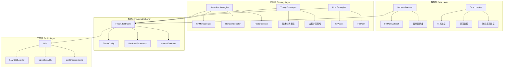
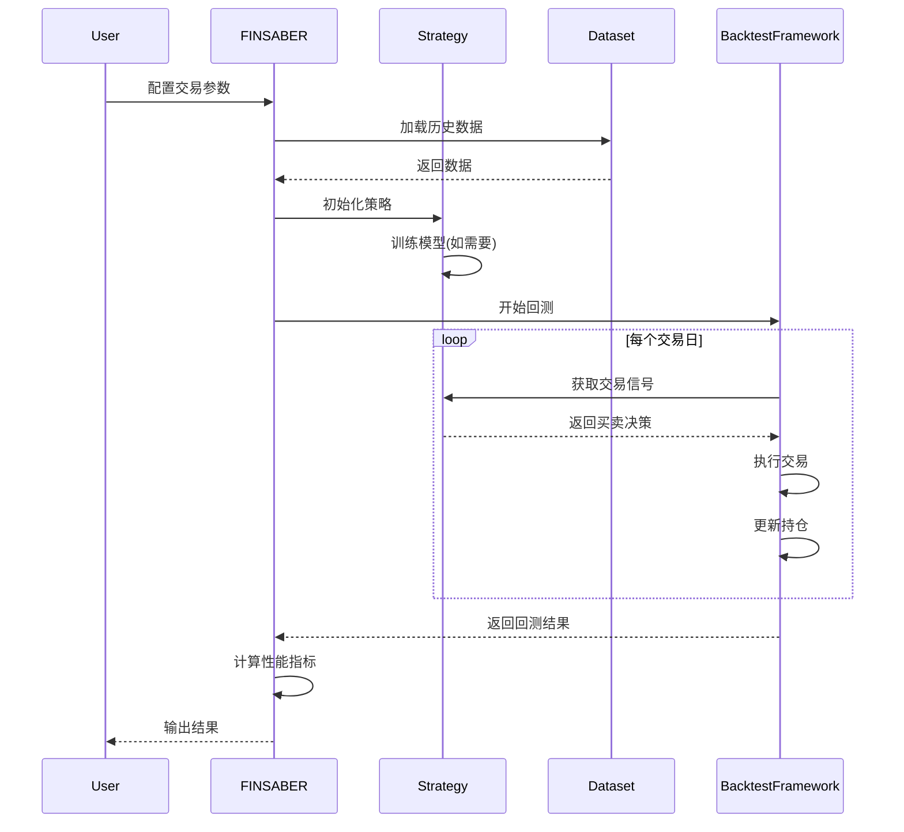

# FINSABER 架构文档

## 项目概览

FINSABER是一个全面的交易策略评估框架，专注于比较传统技术分析方法与现代机器学习和大语言模型(LLM)策略。本框架支持多种策略的回测，包括传统策略、机器学习策略和LLM策略。

## 核心架构

### 整体架构图



## 模块详细说明

### 1. 数据层 (Data Layer)

#### BacktestDataset
- **位置**: `backtest/data_util/backtest_dataset.py`
- **功能**: 抽象基类，定义数据访问接口
- **核心方法**:
  - `get_subset_by_time_range()`: 按时间范围获取数据子集
  - `get_tickers_list()`: 获取所有股票代码列表
  - `get_date_range()`: 获取数据的时间范围

#### FinMemDataset
- **位置**: `backtest/data_util/finmem_dataset.py`
- **功能**: 处理聚合数据格式的具体实现
- **数据结构**:
```python
{
    datetime.date(2024,1,1): {
        "price": {"AAPL": ..., "MSFT": ...},
        "news": {"AAPL": ..., "MSFT": ...},
        "filing_k": {"AAPL": ..., "MSFT": ...},
        "filing_q": {"AAPL": ..., "MSFT": ...}
    }
}
```

### 2. 策略层 (Strategy Layer)

#### 股票选择策略 (Selection Strategies)
- **位置**: `backtest/strategy/selection/`
- **基础类**: `BaseSelector`
- **实现类**:
  - `FinMemSelector`: 基于FinMem数据的选择策略
  - `FinConAgentSelector`: 基于FinCon智能体的选择策略
  - `LowVolatilitySP500Selector`: 低波动率S&P500选择策略
  - `MomentumFactorSP500Selector`: 动量因子S&P500选择策略
  - `RandomSP500Selector`: 随机S&P500选择策略

#### 时序交易策略 (Timing Strategies)

**传统策略** (`backtest/strategy/timing/`):
- `BuyAndHoldStrategy`: 买入持有策略
- `SMACrossoverStrategy`: 简单移动平均交叉策略
- `WMACrossoverStrategy`: 加权移动平均交叉策略
- `BollingerBandsStrategy`: 布林带策略
- `ATRBandStrategy`: ATR带状策略
- `TurnOfTheMonthStrategy`: 月初策略
- `TrendFollowingStrategy`: 趋势跟踪策略

**机器学习策略**:
- `ARIMAPredictorStrategy`: ARIMA预测策略
- `XGBoostPredictorStrategy`: XGBoost预测策略
- `FinRLStrategy`: 强化学习策略

#### LLM策略 (LLM Strategies)
- **位置**: `backtest/strategy/timing_llm/`
- **基础类**: `BaseStrategyISO`
- **实现类**:
  - `FinAgentStrategy`: 基于FinAgent的LLM策略
  - `FinMemStrategy`: 基于FinMem的LLM策略

### 3. 框架层 (Framework Layer)

#### FINSABER核心类
- **位置**: `backtest/finsaber.py`
- **主要方法**:
  - `run_rolling_window()`: 运行滚动窗口回测
  - `run_iterative_tickers()`: 迭代多个股票进行回测
  - `auto_resolve_params()`: 自动解析策略参数

#### TradeConfig
- **位置**: `backtest/toolkit/trade_config.py`
- **功能**: 管理交易配置参数
- **关键属性**:
  - 日期范围、股票列表、现金配置
  - 佣金设置、风险无风险利率
  - 滚动窗口参数、输出配置

#### BacktestFramework
- **位置**: `backtest/toolkit/backtest_framework_iso.py`
- **功能**: 底层回测执行框架
- **核心功能**:
  - 数据加载与处理
  - 策略执行管理
  - 性能指标计算

### 4. LLM Traders模块

#### FinAgent
- **位置**: `llm_traders/finagent/`
- **组件**:
  - `environment/`: 交易环境模拟
  - `memory/`: 记忆管理系统
  - `prompt/`: 提示词管理
  - `provider/`: LLM服务提供商接口
  - `tools/`: 交易工具集

#### FinMem
- **位置**: `llm_traders/finmem/`
- **特性**:
  - 基于记忆增强的LLM交易系统
  - 支持多种记忆机制
  - 集成情感分析和市场智能

### 5. 工具层 (Toolkit Layer)

#### 核心工具类
- `LLMCostMonitor`: LLM调用成本监控
- `Metrics`: 交易性能指标计算
- `OperationUtils`: 通用操作工具
- `CustomExceptions`: 自定义异常类

## 数据流程



## 扩展性设计

### 添加新策略
1. 继承相应的基类 (`BaseStrategy` 或 `BaseStrategyISO`)
2. 实现必要的方法 (`next()`, `train()` 等)
3. 在配置中注册新策略

### 添加新数据源
1. 继承 `BacktestDataset` 基类
2. 实现数据访问接口
3. 更新数据加载器配置

### 添加新选择策略
1. 继承 `BaseSelector` 基类
2. 实现 `select()` 方法
3. 在FINSABER核心类中注册

## 配置管理

### 策略配置文件
- **位置**: `strats_configs/`
- **格式**: JSON/TOML
- **内容**: 策略参数、模型配置、输出设置

### 环境变量
- `OPENAI_API_KEY`: OpenAI API密钥
- `HF_ACCESS_TOKEN`: Hugging Face访问令牌

## 性能优化

### 并行处理
- 支持多股票并行回测
- 利用Progress库显示进度

### 内存管理
- 按需加载数据子集
- 及时释放不需要的数据

### 缓存机制
- 选择策略结果缓存
- 模型训练结果缓存

## 错误处理

### 异常类型
- `InsufficientTrainingDataException`: 训练数据不足
- 数据缺失异常
- 模型训练失败异常

### 容错机制
- 自动跳过问题股票
- 优雅降级处理
- 详细错误日志记录