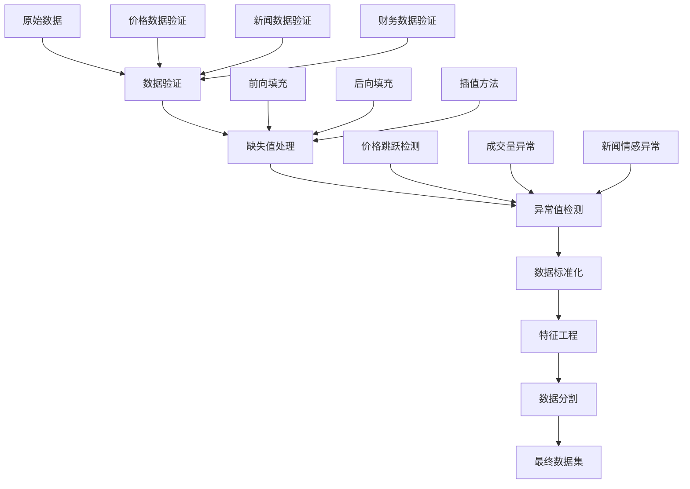

# 数据格式规范

本文档详细描述FINSABER框架支持的数据格式和数据处理流程。

## 支持的数据格式

### 1. 聚合数据格式（推荐）

#### 数据结构

聚合数据格式是一个嵌套字典结构，按日期组织多类型数据：

```python
{
    datetime.date(2024, 1, 1): {
        "price": {
            "AAPL": {
                "open": 150.0,
                "high": 155.0,
                "low": 149.0,
                "close": 154.0,
                "volume": 1000000,
                "adj_close": 154.0
            },
            "MSFT": {
                "open": 300.0,
                "high": 305.0,
                "low": 298.0,
                "close": 304.0,
                "volume": 800000,
                "adj_close": 304.0
            }
        },
        "news": {
            "AAPL": [
                {
                    "title": "Apple发布新产品",
                    "content": "苹果公司今日发布...",
                    "sentiment": 0.8,
                    "source": "Reuters",
                    "timestamp": "2024-01-01T09:00:00Z"
                }
            ],
            "MSFT": [...]
        },
        "filing_k": {
            "AAPL": {
                "content": "10-K报告内容...",
                "file_date": "2023-12-31",
                "summary": "年度财务报告摘要"
            }
        },
        "filing_q": {
            "AAPL": {
                "content": "10-Q报告内容...",
                "file_date": "2023-12-31", 
                "summary": "季度财务报告摘要"
            }
        }
    },
    datetime.date(2024, 1, 2): {
        # 下一日数据...
    }
}
```

#### 字段说明

**价格数据字段**:
- `open`: 开盘价
- `high`: 最高价  
- `low`: 最低价
- `close`: 收盘价
- `volume`: 成交量
- `adj_close`: 复权收盘价

**新闻数据字段**:
- `title`: 新闻标题
- `content`: 新闻正文
- `sentiment`: 情感得分 (-1到1)
- `source`: 新闻来源
- `timestamp`: 新闻时间戳

**财务报表字段**:
- `content`: 报表原始内容
- `file_date`: 报表日期
- `summary`: 报表摘要

### 2. CSV数据格式

#### 单股票CSV格式

```csv
Date,Open,High,Low,Close,Volume,Adj Close
2024-01-01,150.0,155.0,149.0,154.0,1000000,154.0
2024-01-02,154.5,158.0,153.0,157.0,1200000,157.0
```

#### 多股票CSV格式

```csv
Date,Symbol,Open,High,Low,Close,Volume,Adj Close
2024-01-01,AAPL,150.0,155.0,149.0,154.0,1000000,154.0
2024-01-01,MSFT,300.0,305.0,298.0,304.0,800000,304.0
2024-01-02,AAPL,154.5,158.0,153.0,157.0,1200000,157.0
```

## 数据访问接口

### BacktestDataset基类

```python
from abc import ABC, abstractmethod
from typing import List, Tuple, Dict, Any
import pandas as pd

class BacktestDataset(ABC):
    @abstractmethod
    def get_subset_by_time_range(self, start_date: str, end_date: str) -> 'BacktestDataset':
        """获取时间范围内的数据子集"""
        pass
        
    @abstractmethod
    def get_tickers_list(self) -> List[str]:
        """获取所有股票代码列表"""
        pass
        
    @abstractmethod
    def get_date_range(self) -> Tuple[str, str]:
        """获取数据的时间范围"""
        pass
        
    @abstractmethod
    def get_price_data(self, ticker: str, date: str) -> Dict[str, float]:
        """获取特定股票特定日期的价格数据"""
        pass
        
    @abstractmethod
    def get_news_data(self, ticker: str, date: str) -> List[Dict[str, Any]]:
        """获取特定股票特定日期的新闻数据"""
        pass
        
    @abstractmethod
    def has_ticker(self, ticker: str) -> bool:
        """检查是否包含特定股票"""
        pass
```

### FinMemDataset实现

```python
import pickle
import pandas as pd
from datetime import datetime, date

class FinMemDataset(BacktestDataset):
    def __init__(self, data_path: str, data_type: str = "aggregated"):
        self.data_path = data_path
        self.data_type = data_type
        self.data = self._load_data()
        
    def _load_data(self):
        """加载数据"""
        if self.data_type == "aggregated":
            with open(self.data_path, "rb") as f:
                return pickle.load(f)
        elif self.data_type == "csv":
            return pd.read_csv(self.data_path)
        else:
            raise ValueError(f"不支持的数据类型: {self.data_type}")
            
    def get_subset_by_time_range(self, start_date: str, end_date: str) -> 'FinMemDataset':
        """获取时间范围子集"""
        start_dt = pd.to_datetime(start_date).date()
        end_dt = pd.to_datetime(end_date).date()
        
        if self.data_type == "aggregated":
            subset_data = {
                dt: data for dt, data in self.data.items()
                if start_dt <= dt <= end_dt
            }
        else:  # CSV format
            mask = (pd.to_datetime(self.data['Date']) >= start_date) & \
                   (pd.to_datetime(self.data['Date']) <= end_date)
            subset_data = self.data[mask].copy()
            
        # 创建新实例
        new_instance = FinMemDataset.__new__(FinMemDataset)
        new_instance.data_path = self.data_path
        new_instance.data_type = self.data_type
        new_instance.data = subset_data
        return new_instance
        
    def get_tickers_list(self) -> List[str]:
        """获取股票列表"""
        if self.data_type == "aggregated":
            if not self.data:
                return []
            first_date = next(iter(self.data.keys()))
            price_data = self.data[first_date].get("price", {})
            return list(price_data.keys())
        else:  # CSV format
            if 'Symbol' in self.data.columns:
                return self.data['Symbol'].unique().tolist()
            else:
                return ["DEFAULT"]  # 单股票CSV文件
                
    def get_date_range(self) -> Tuple[str, str]:
        """获取日期范围"""
        if self.data_type == "aggregated":
            dates = list(self.data.keys())
            if not dates:
                return ("", "")
            dates.sort()
            return (str(dates[0]), str(dates[-1]))
        else:  # CSV format
            dates = pd.to_datetime(self.data['Date'])
            return (str(dates.min().date()), str(dates.max().date()))
```

## 数据预处理

### 数据清洗流程



### 数据验证工具

```python
class DataValidator:
    def __init__(self, dataset: BacktestDataset):
        self.dataset = dataset
        
    def validate_price_data(self) -> Dict[str, List[str]]:
        """验证价格数据"""
        issues = {
            "missing_dates": [],
            "negative_prices": [],
            "zero_volume": [],
            "price_jumps": []
        }
        
        tickers = self.dataset.get_tickers_list()
        start_date, end_date = self.dataset.get_date_range()
        
        # 生成完整日期序列
        date_range = pd.date_range(start_date, end_date, freq='D')
        
        for ticker in tickers:
            for date in date_range:
                date_str = date.strftime('%Y-%m-%d')
                
                try:
                    price_data = self.dataset.get_price_data(ticker, date_str)
                    
                    # 检查缺失数据
                    if not price_data:
                        issues["missing_dates"].append(f"{ticker}:{date_str}")
                        continue
                        
                    # 检查负价格
                    for field in ['open', 'high', 'low', 'close']:
                        if field in price_data and price_data[field] < 0:
                            issues["negative_prices"].append(f"{ticker}:{date_str}:{field}")
                            
                    # 检查零成交量
                    if price_data.get('volume', 0) == 0:
                        issues["zero_volume"].append(f"{ticker}:{date_str}")
                        
                except Exception as e:
                    issues["missing_dates"].append(f"{ticker}:{date_str}")
                    
        return issues
        
    def validate_news_data(self) -> Dict[str, List[str]]:
        """验证新闻数据"""
        issues = {
            "empty_content": [],
            "invalid_sentiment": [],
            "missing_timestamp": []
        }
        
        # 实现新闻数据验证逻辑
        return issues
        
    def generate_report(self) -> str:
        """生成验证报告"""
        price_issues = self.validate_price_data()
        news_issues = self.validate_news_data()
        
        report = "数据验证报告\n" + "="*50 + "\n\n"
        
        # 价格数据问题
        report += "价格数据问题:\n"
        for issue_type, issues in price_issues.items():
            report += f"  {issue_type}: {len(issues)}个问题\n"
            if issues:
                report += f"    示例: {issues[:3]}\n"
                
        # 新闻数据问题
        report += "\n新闻数据问题:\n"
        for issue_type, issues in news_issues.items():
            report += f"  {issue_type}: {len(issues)}个问题\n"
            if issues:
                report += f"    示例: {issues[:3]}\n"
                
        return report
```

### 数据转换工具

```python
class DataConverter:
    @staticmethod
    def csv_to_aggregated(csv_path: str, output_path: str):
        """将CSV格式转换为聚合格式"""
        df = pd.read_csv(csv_path)
        
        # 检查CSV格式
        if 'Symbol' in df.columns:
            # 多股票格式
            aggregated_data = {}
            
            for date_str in df['Date'].unique():
                date_obj = pd.to_datetime(date_str).date()
                aggregated_data[date_obj] = {"price": {}}
                
                date_data = df[df['Date'] == date_str]
                
                for _, row in date_data.iterrows():
                    symbol = row['Symbol']
                    aggregated_data[date_obj]["price"][symbol] = {
                        "open": row['Open'],
                        "high": row['High'],
                        "low": row['Low'],
                        "close": row['Close'],
                        "volume": row['Volume'],
                        "adj_close": row.get('Adj Close', row['Close'])
                    }
        else:
            # 单股票格式，假设文件名包含股票代码
            symbol = csv_path.split('/')[-1].split('.')[0].upper()
            aggregated_data = {}
            
            for _, row in df.iterrows():
                date_obj = pd.to_datetime(row['Date']).date()
                aggregated_data[date_obj] = {
                    "price": {
                        symbol: {
                            "open": row['Open'],
                            "high": row['High'],
                            "low": row['Low'],
                            "close": row['Close'],
                            "volume": row['Volume'],
                            "adj_close": row.get('Adj Close', row['Close'])
                        }
                    }
                }
                
        # 保存聚合数据
        with open(output_path, "wb") as f:
            pickle.dump(aggregated_data, f)
            
        print(f"转换完成: {csv_path} -> {output_path}")
        
    @staticmethod
    def aggregated_to_csv(aggregated_path: str, output_dir: str):
        """将聚合格式转换为CSV格式"""
        with open(aggregated_path, "rb") as f:
            data = pickle.load(f)
            
        # 提取价格数据
        price_records = []
        
        for date_obj, day_data in data.items():
            price_data = day_data.get("price", {})
            
            for symbol, price_info in price_data.items():
                price_records.append({
                    "Date": date_obj.strftime('%Y-%m-%d'),
                    "Symbol": symbol,
                    "Open": price_info.get("open"),
                    "High": price_info.get("high"),
                    "Low": price_info.get("low"),
                    "Close": price_info.get("close"),
                    "Volume": price_info.get("volume"),
                    "Adj Close": price_info.get("adj_close")
                })
                
        # 保存为CSV
        df = pd.DataFrame(price_records)
        output_path = f"{output_dir}/converted_prices.csv"
        df.to_csv(output_path, index=False)
        
        print(f"转换完成: {aggregated_path} -> {output_path}")
```

## 数据质量检查

### 自动化质量检查

```python
class DataQualityChecker:
    def __init__(self, dataset: BacktestDataset):
        self.dataset = dataset
        
    def check_completeness(self) -> float:
        """检查数据完整性"""
        tickers = self.dataset.get_tickers_list()
        start_date, end_date = self.dataset.get_date_range()
        
        # 计算预期数据点数量
        date_range = pd.bdate_range(start_date, end_date)  # 工作日
        expected_points = len(tickers) * len(date_range)
        
        # 计算实际数据点数量
        actual_points = 0
        
        for ticker in tickers:
            for date in date_range:
                date_str = date.strftime('%Y-%m-%d')
                try:
                    price_data = self.dataset.get_price_data(ticker, date_str)
                    if price_data:
                        actual_points += 1
                except:
                    pass
                    
        return actual_points / expected_points if expected_points > 0 else 0
        
    def check_consistency(self) -> Dict[str, float]:
        """检查数据一致性"""
        results = {
            "price_consistency": 0.0,
            "volume_consistency": 0.0
        }
        
        tickers = self.dataset.get_tickers_list()
        inconsistencies = 0
        total_checks = 0
        
        for ticker in tickers:
            # 获取该股票的所有数据
            # 检查 high >= low >= 0
            # 检查 high >= open, close
            # 检查 low <= open, close
            # 等等...
            pass
            
        return results
        
    def generate_quality_report(self) -> str:
        """生成数据质量报告"""
        completeness = self.check_completeness()
        consistency = self.check_consistency()
        
        report = f"""
数据质量报告
{'='*50}

完整性分析:
  数据完整度: {completeness:.2%}

一致性分析:
  价格一致性: {consistency['price_consistency']:.2%}
  成交量一致性: {consistency['volume_consistency']:.2%}

建议:
"""
        
        if completeness < 0.95:
            report += "  - 数据缺失较多，建议补充缺失数据\n"
            
        if consistency['price_consistency'] < 0.99:
            report += "  - 价格数据存在不一致，建议检查数据源\n"
            
        return report
```

## 使用示例

### 基本使用

```python
# 加载聚合数据
dataset = FinMemDataset("data/sp500_aggregated.pkl", data_type="aggregated")

# 获取数据信息
print(f"股票数量: {len(dataset.get_tickers_list())}")
print(f"时间范围: {dataset.get_date_range()}")

# 获取子集
subset = dataset.get_subset_by_time_range("2020-01-01", "2021-01-01")

# 数据验证
validator = DataValidator(dataset)
validation_report = validator.generate_report()
print(validation_report)
```

### 数据转换

```python
# CSV转聚合格式
DataConverter.csv_to_aggregated(
    "data/prices.csv", 
    "data/aggregated_prices.pkl"
)

# 聚合格式转CSV
DataConverter.aggregated_to_csv(
    "data/aggregated_prices.pkl",
    "data/output/"
)
```

### 质量检查

```python
# 数据质量检查
checker = DataQualityChecker(dataset)
quality_report = checker.generate_quality_report()
print(quality_report)
```

通过遵循这些数据格式规范和使用相应的工具，可以确保FINSABER框架能够正确处理和分析您的金融数据。