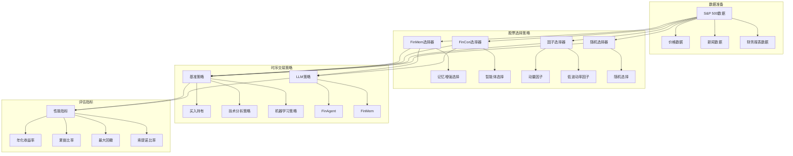

# 实验复现指南

本指南详细介绍如何复现FINSABER论文中的实验结果。论文包含三个主要实验设置：选择性设置(Cherry Picking)、选择4股票设置(Selected-4)和组合设置(Composite)。

## 实验概述

### 实验架构



## 实验设置详解

### 1. Cherry Picking设置

这种设置模拟研究人员选择性展示结果的情况。

#### 数据配置
- **时间范围**: 2022-10-05 到 2023-06-10（约8个月）
- **股票池**: 基于FinMem或FinCon智能体选择
- **选择数量**: 每个时期选择表现最优的股票

#### 运行FinMem Cherry Picking

```bash
# 基准策略
python backtest/run_baselines_exp.py \
    --setup cherry_pick_both_finmem \
    --include BuyAndHoldStrategy \
    --date_from 2022-10-05 \
    --date_to 2023-06-10 \
    --training_years 2 \
    --rolling_window_size 1 \
    --rolling_window_step 1

# 技术分析策略
python backtest/run_baselines_exp.py \
    --setup cherry_pick_both_finmem \
    --include SMACrossStrategy \
    --date_from 2022-10-05 \
    --date_to 2023-06-10 \
    --training_years 2 \
    --rolling_window_size 1 \
    --rolling_window_step 1

# LLM策略
python backtest/run_llm_traders_exp.py \
    --setup cherry_pick_both_finmem \
    --strategy FinMemStrategy \
    --strat_config_path strats_configs/finmem_config_cherry.json \
    --date_from 2022-10-05 \
    --date_to 2023-06-10 \
    --rolling_window_size 1 \
    --rolling_window_step 1
```

#### 运行FinCon Cherry Picking

```bash
# FinAgent策略
python backtest/run_llm_traders_exp.py \
    --setup cherry_pick_both_fincon \
    --strategy FinAgentStrategy \
    --strat_config_path strats_configs/finagent_config_cherry.json \
    --date_from 2022-10-05 \
    --date_to 2023-06-10 \
    --rolling_window_size 1 \
    --rolling_window_step 1
```

### 2. Selected-4设置

选择固定的4只股票进行长期测试。

#### 股票选择
- **TSLA** (Tesla)
- **AMZN** (Amazon)  
- **MSFT** (Microsoft)
- **NFLX** (Netflix)

#### 运行Selected-4实验

```bash
# 基准策略 - 买入持有
python backtest/run_baselines_exp.py \
    --setup selected_4 \
    --include BuyAndHoldStrategy \
    --date_from 2004-01-01 \
    --date_to 2024-01-01 \
    --training_years 2 \
    --rolling_window_size 2 \
    --rolling_window_step 1

# 技术分析策略 - SMA交叉
python backtest/run_baselines_exp.py \
    --setup selected_4 \
    --include SMACrossStrategy \
    --date_from 2004-01-01 \
    --date_to 2024-01-01 \
    --training_years 2 \
    --rolling_window_size 2 \
    --rolling_window_step 1

# 机器学习策略 - XGBoost
python backtest/run_baselines_exp.py \
    --setup selected_4 \
    --include XGBoostPredictorStrategy \
    --date_from 2004-01-01 \
    --date_to 2024-01-01 \
    --training_years 3 \
    --rolling_window_size 2 \
    --rolling_window_step 1

# LLM策略 - FinMem
python backtest/run_llm_traders_exp.py \
    --setup selected_4 \
    --strategy FinMemStrategy \
    --strat_config_path strats_configs/finmem_config_normal.json \
    --date_from 2004-01-01 \
    --date_to 2024-01-01 \
    --rolling_window_size 2 \
    --rolling_window_step 1

# LLM策略 - FinAgent
python backtest/run_llm_traders_exp.py \
    --setup selected_4 \
    --strategy FinAgentStrategy \
    --strat_config_path strats_configs/finagent_config_normal.json \
    --date_from 2004-01-01 \
    --date_to 2024-01-01 \
    --rolling_window_size 2 \
    --rolling_window_step 1
```

### 3. Composite设置

使用不同的股票选择策略，更接近实际投资场景。

#### 子设置说明

**Random S&P 500-5**: 从S&P 500中随机选择5只股票
```bash
python backtest/run_baselines_exp.py \
    --setup random_sp500_5 \
    --include BuyAndHoldStrategy \
    --date_from 2004-01-01 \
    --date_to 2024-01-01 \
    --training_years 2 \
    --rolling_window_size 2 \
    --rolling_window_step 1
```

**Momentum S&P 500-5**: 基于动量因子选择股票
```bash
python backtest/run_baselines_exp.py \
    --setup momentum_sp500_5 \
    --include BuyAndHoldStrategy \
    --date_from 2004-01-01 \
    --date_to 2024-01-01 \
    --training_years 2 \
    --rolling_window_size 2 \
    --rolling_window_step 1
```

**Low Volatility S&P 500-5**: 基于低波动率选择股票
```bash
python backtest/run_baselines_exp.py \
    --setup lowvol_sp500_5 \
    --include BuyAndHoldStrategy \
    --date_from 2004-01-01 \
    --date_to 2024-01-01 \
    --training_years 2 \
    --rolling_window_size 2 \
    --rolling_window_step 1
```

## 策略详细配置

### 基准策略列表

#### 技术分析策略
```bash
# 简单移动平均交叉
--include SMACrossStrategy

# 加权移动平均交叉  
--include WMAStrategy

# 布林带策略
--include BollingerBandsStrategy

# ATR带状策略
--include ATRBandStrategy

# 月初效应策略
--include TurnOfTheMonthStrategy

# 趋势跟踪策略
--include TrendFollowingStrategy
```

#### 机器学习策略
```bash
# ARIMA预测策略
--include ARIMAPredictorStrategy

# XGBoost预测策略  
--include XGBoostPredictorStrategy

# 强化学习策略
--include FinRLStrategy
```

### LLM策略配置

#### FinMem策略配置

**Normal配置** (`strats_configs/finmem_config_normal.json`):
```json
{
    "model": "gpt-4",
    "temperature": 0.1,
    "memory_decay": 0.99,
    "reflection_threshold": 0.8,
    "max_memory_items": 100
}
```

**Cherry Picking配置** (`strats_configs/finmem_config_cherry.json`):
```json
{
    "model": "gpt-4",
    "temperature": 0.05,
    "memory_decay": 0.95,
    "reflection_threshold": 0.9,
    "max_memory_items": 50
}
```

**Composite配置** (`strats_configs/finmem_config_composite.json`):
```json
{
    "model": "gpt-3.5-turbo",
    "temperature": 0.2,
    "memory_decay": 0.98,
    "reflection_threshold": 0.7,
    "max_memory_items": 200
}
```

#### FinAgent策略配置

**Normal配置** (`strats_configs/finagent_config_normal.json`):
```json
{
    "model": "gpt-4",
    "temperature": 0.1,
    "use_tools": true,
    "enable_reflection": true,
    "decision_confidence_threshold": 0.7
}
```

## 批量实验脚本

### 运行所有基准策略

创建批量运行脚本 `run_all_baselines.sh`:

```bash
#!/bin/bash

# 定义策略列表
strategies=(
    "BuyAndHoldStrategy"
    "SMACrossStrategy" 
    "WMAStrategy"
    "BollingerBandsStrategy"
    "ATRBandStrategy"
    "TurnOfTheMonthStrategy"
    "ARIMAPredictorStrategy"
    "XGBoostPredictorStrategy"
)

# 定义设置列表
setups=(
    "selected_4"
    "random_sp500_5"
    "momentum_sp500_5" 
    "lowvol_sp500_5"
)

# 批量运行
for setup in "${setups[@]}"; do
    for strategy in "${strategies[@]}"; do
        echo "运行 $strategy on $setup"
        python backtest/run_baselines_exp.py \
            --setup $setup \
            --include $strategy \
            --date_from 2004-01-01 \
            --date_to 2024-01-01 \
            --training_years 2 \
            --rolling_window_size 2 \
            --rolling_window_step 1
    done
done
```

### 运行所有LLM策略

创建批量运行脚本 `run_all_llm.sh`:

```bash
#!/bin/bash

# FinMem策略
setups=("selected_4" "random_sp500_5" "momentum_sp500_5" "lowvol_sp500_5")

for setup in "${setups[@]}"; do
    echo "运行 FinMemStrategy on $setup"
    python backtest/run_llm_traders_exp.py \
        --setup $setup \
        --strategy FinMemStrategy \
        --strat_config_path strats_configs/finmem_config_normal.json \
        --date_from 2004-01-01 \
        --date_to 2024-01-01 \
        --rolling_window_size 2 \
        --rolling_window_step 1
        
    echo "运行 FinAgentStrategy on $setup"  
    python backtest/run_llm_traders_exp.py \
        --setup $setup \
        --strategy FinAgentStrategy \
        --strat_config_path strats_configs/finagent_config_normal.json \
        --date_from 2004-01-01 \
        --date_to 2024-01-01 \
        --rolling_window_size 2 \
        --rolling_window_step 1
done
```

## 结果分析

### 结果聚合与分析

运行结果聚合脚本：

```python
from backtest.toolkit.operation_utils import aggregate_results_one_strategy
import os

# 聚合所有策略结果
setups = ["selected_4", "random_sp500_5", "momentum_sp500_5", "lowvol_sp500_5"]
strategies = ["BuyAndHoldStrategy", "SMACrossStrategy", "FinMemStrategy", "FinAgentStrategy"]

for setup in setups:
    for strategy in strategies:
        try:
            aggregate_results_one_strategy(setup, strategy)
            print(f"聚合完成: {setup}/{strategy}")
        except Exception as e:
            print(f"聚合失败: {setup}/{strategy}, 错误: {e}")
```

### 生成性能报告

```python
import pandas as pd
import pickle
import glob

def generate_performance_report():
    """生成性能分析报告"""
    results_dir = "backtest/output"
    report_data = []
    
    # 遍历所有结果文件
    for result_file in glob.glob(f"{results_dir}/**/*.pkl", recursive=True):
        try:
            with open(result_file, "rb") as f:
                data = pickle.load(f)
                
            # 解析路径信息
            path_parts = result_file.replace(results_dir + "/", "").split("/")
            setup = path_parts[0]
            strategy = path_parts[1]
            filename = path_parts[2].replace(".pkl", "")
            
            # 提取指标
            for period, tickers in data.items():
                for ticker, metrics in tickers.items():
                    report_data.append({
                        "Setup": setup,
                        "Strategy": strategy,
                        "Period": period,
                        "Ticker": ticker,
                        "Annual_Return": metrics.get("annual_return", 0),
                        "Sharpe_Ratio": metrics.get("sharpe_ratio", 0),
                        "Max_Drawdown": metrics.get("max_drawdown", 0),
                        "Sortino_Ratio": metrics.get("sortino_ratio", 0)
                    })
                    
        except Exception as e:
            print(f"处理文件失败: {result_file}, 错误: {e}")
    
    # 创建报告DataFrame
    df = pd.DataFrame(report_data)
    
    # 按设置和策略分组统计
    summary = df.groupby(["Setup", "Strategy"]).agg({
        "Annual_Return": ["mean", "std"],
        "Sharpe_Ratio": ["mean", "std"], 
        "Max_Drawdown": ["mean", "std"]
    }).round(4)
    
    # 保存报告
    summary.to_csv("performance_report.csv")
    df.to_csv("detailed_results.csv", index=False)
    
    print("性能报告已生成: performance_report.csv")
    print("详细结果已保存: detailed_results.csv")
    
    return summary

# 生成报告
summary = generate_performance_report()
print(summary)
```

### 生成夏普比率热力图

```python
import matplotlib.pyplot as plt
import seaborn as sns
import pandas as pd

def create_sharpe_heatmap():
    """创建夏普比率热力图"""
    # 读取聚合结果
    df = pd.read_csv("detailed_results.csv")
    
    # 创建透视表
    heatmap_data = df.pivot_table(
        values="Sharpe_Ratio",
        index="Strategy", 
        columns="Setup",
        aggfunc="mean"
    )
    
    # 绘制热力图
    plt.figure(figsize=(12, 8))
    sns.heatmap(
        heatmap_data, 
        annot=True, 
        cmap="RdYlGn", 
        center=0,
        fmt=".3f",
        cbar_kws={"label": "夏普比率"}
    )
    
    plt.title("策略夏普比率热力图")
    plt.xlabel("实验设置")
    plt.ylabel("交易策略")
    plt.tight_layout()
    
    # 保存图片
    plt.savefig("sharpe_heatmap.png", dpi=300, bbox_inches="tight")
    plt.savefig("sharpe_heatmap.pdf", bbox_inches="tight")
    plt.show()

# 生成热力图
create_sharpe_heatmap()
```

## 实验环境要求

### 硬件要求
- **CPU**: 8核心以上推荐
- **内存**: 16GB以上
- **存储**: 50GB可用空间
- **GPU**: LLM策略推荐使用GPU加速

### 软件依赖
- Python 3.10
- CUDA 11.8+ (如使用GPU)
- 所有requirements.txt中的依赖

### 运行时估计
不同策略的运行时间估计：

| 策略类型 | Selected-4 | Composite (每个设置) |
|---------|------------|---------------------|
| 技术分析策略 | 10-30分钟 | 1-3小时 |
| 机器学习策略 | 30分钟-2小时 | 3-8小时 |
| LLM策略 | 2-6小时 | 8-24小时 |

## 故障排除

### 常见问题

#### 1. 内存不足
```python
# 解决方案：分批处理
import gc

def run_batch_experiments(tickers, batch_size=2):
    for i in range(0, len(tickers), batch_size):
        batch = tickers[i:i+batch_size]
        # 运行批次
        run_experiment_batch(batch)
        # 清理内存
        gc.collect()
```

#### 2. LLM API限制
```python
# 解决方案：添加重试机制
import time
import random

def api_call_with_retry(func, max_retries=3):
    for attempt in range(max_retries):
        try:
            return func()
        except Exception as e:
            if attempt < max_retries - 1:
                wait_time = 2 ** attempt + random.uniform(0, 1)
                time.sleep(wait_time)
            else:
                raise e
```

#### 3. 数据缺失处理
```python
# 在配置中设置数据验证
trade_config = {
    "validate_data": True,
    "min_data_points": 252,  # 至少1年数据
    "skip_missing_tickers": True
}
```

### 结果验证

验证实验结果的正确性：

```python
def validate_results(results_file):
    """验证结果文件"""
    with open(results_file, "rb") as f:
        data = pickle.load(f)
    
    checks = []
    
    for period, tickers in data.items():
        for ticker, metrics in tickers.items():
            # 检查基本指标
            if "annual_return" not in metrics:
                checks.append(f"缺失annual_return: {ticker}")
            
            if "sharpe_ratio" not in metrics:
                checks.append(f"缺失sharpe_ratio: {ticker}")
                
            # 检查数值合理性
            if abs(metrics.get("annual_return", 0)) > 10:  # 1000%收益率
                checks.append(f"异常收益率: {ticker}")
                
            if abs(metrics.get("sharpe_ratio", 0)) > 10:
                checks.append(f"异常夏普比率: {ticker}")
    
    return checks

# 验证所有结果
for result_file in glob.glob("backtest/output/**/*.pkl", recursive=True):
    issues = validate_results(result_file)
    if issues:
        print(f"文件 {result_file} 存在问题:")
        for issue in issues:
            print(f"  - {issue}")
```

通过遵循这个实验复现指南，您可以完整复现FINSABER论文中的所有实验结果，并进行进一步的分析和扩展研究。