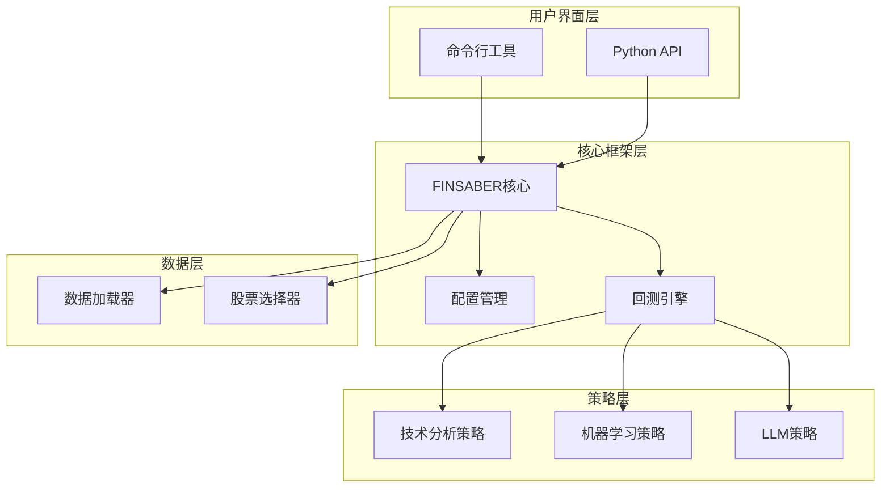

# FINSABER 文档中心

欢迎来到FINSABER框架的完整文档中心。这里包含了使用FINSABER进行金融策略回测和研究所需的所有信息。

## 📖 文档导航

### 快速开始
- **[快速入门指南](quickstart.md)** - 10分钟上手FINSABER
- **[安装配置](quickstart.md#安装与配置)** - 环境搭建和依赖安装
- **[第一个回测](quickstart.md#第一个回测实验)** - 运行你的第一个策略

### 核心概念
- **[架构文档](architecture.md)** - 深入了解FINSABER的设计架构
- **[数据格式规范](data_format.md)** - 支持的数据格式和处理方式
- **[配置指南](configuration.md)** - 详细的配置参数说明

### 开发指南  
- **[API参考](api_reference.md)** - 完整的API接口文档
- **[策略开发指南](strategy_development.md)** - 如何开发自定义策略
- **[实验复现指南](experiments.md)** - 复现论文实验结果

## 🚀 快速链接

### 常用功能
| 功能 | 文档链接 | 描述 |
|------|----------|------|
| 基础回测 | [快速入门](quickstart.md#基础回测示例) | 运行简单的买入持有策略 |
| 技术分析策略 | [策略开发](strategy_development.md#技术分析策略开发) | 开发技术指标策略 |
| LLM策略 | [快速入门](quickstart.md#运行LLM策略) | 使用大语言模型进行交易 |
| 数据准备 | [数据格式](data_format.md#数据准备) | 准备和加载交易数据 |

### 实验复现
| 实验设置 | 文档链接 | 说明 |
|----------|----------|------|
| Cherry Picking | [实验复现](experiments.md#cherry-picking设置) | 选择性结果展示实验 |
| Selected-4 | [实验复现](experiments.md#selected-4设置) | 固定4股票长期测试 |
| Composite | [实验复现](experiments.md#composite设置) | 多种选择策略组合 |

## 🔧 开发资源

### 代码示例
```python
# 基础回测示例
from backtest.finsaber import FINSABER
from backtest.data_util.finmem_dataset import FinMemDataset
from backtest.strategy.timing.buy_and_hold import BuyAndHoldStrategy

# 加载数据并配置
dataset = FinMemDataset("path/to/data.pkl")
config = {
    "cash": 100000,
    "date_from": "2020-01-01",
    "date_to": "2021-01-01", 
    "tickers": ["AAPL", "MSFT"],
    "data_loader": dataset
}

# 运行回测
finsaber = FINSABER(config)
results = finsaber.run_iterative_tickers(BuyAndHoldStrategy)
```

### 命令行快速参考
```bash
# 运行基准策略
python backtest/run_baselines_exp.py --setup selected_4 --include BuyAndHoldStrategy

# 运行LLM策略
python backtest/run_llm_traders_exp.py --setup selected_4 --strategy FinMemStrategy

# 查看可用的策略
ls backtest/strategy/timing/
ls backtest/strategy/timing_llm/
```

## 📊 架构概览

FINSABER采用模块化设计，主要包含以下组件：



## 🎯 使用场景

### 学术研究
- **因子分析**: 使用多种选择策略测试因子效果
- **策略比较**: 系统性比较传统策略vs机器学习vs LLM策略  
- **论文复现**: 完整复现FINSABER论文实验

### 量化投资
- **策略开发**: 快速原型化和测试新策略
- **风险管理**: 内置风险指标计算和控制
- **组合优化**: 多股票、多策略组合管理

### 教学培训
- **金融工程教学**: 实践量化策略开发
- **机器学习应用**: 金融数据上的ML实战
- **LLM研究**: 大语言模型在金融领域的应用

## 🆘 获取帮助

### 常见问题
1. **数据格式问题**: 参考[数据格式文档](data_format.md)
2. **配置错误**: 查看[配置指南](configuration.md)  
3. **策略开发**: 阅读[策略开发指南](strategy_development.md)

### 社区支持
- **GitHub Issues**: [提交Bug报告或功能请求](https://github.com/waylonli/FINSABER/issues)
- **论文引用**: [arXiv:2505.07078](https://arxiv.org/abs/2505.07078)
- **PyPI包**: [finsaber](https://pypi.org/project/finsaber/)

### 联系方式
如果文档无法解决您的问题，请：
1. 检查[GitHub Issues](https://github.com/waylonli/FINSABER/issues)中是否有类似问题
2. 在GitHub上创建新的Issue，详细描述问题和环境信息
3. 参考论文中的联系方式

## 📈 版本历史

- **v1.0.0**: 初始版本发布
- **文档v1.0**: 完整文档体系建立

---

**开始使用**: 建议先阅读[快速入门指南](quickstart.md)，然后根据需要查看相应的专题文档。

**贡献文档**: 欢迎提交改进建议或补充内容到项目的GitHub仓库。