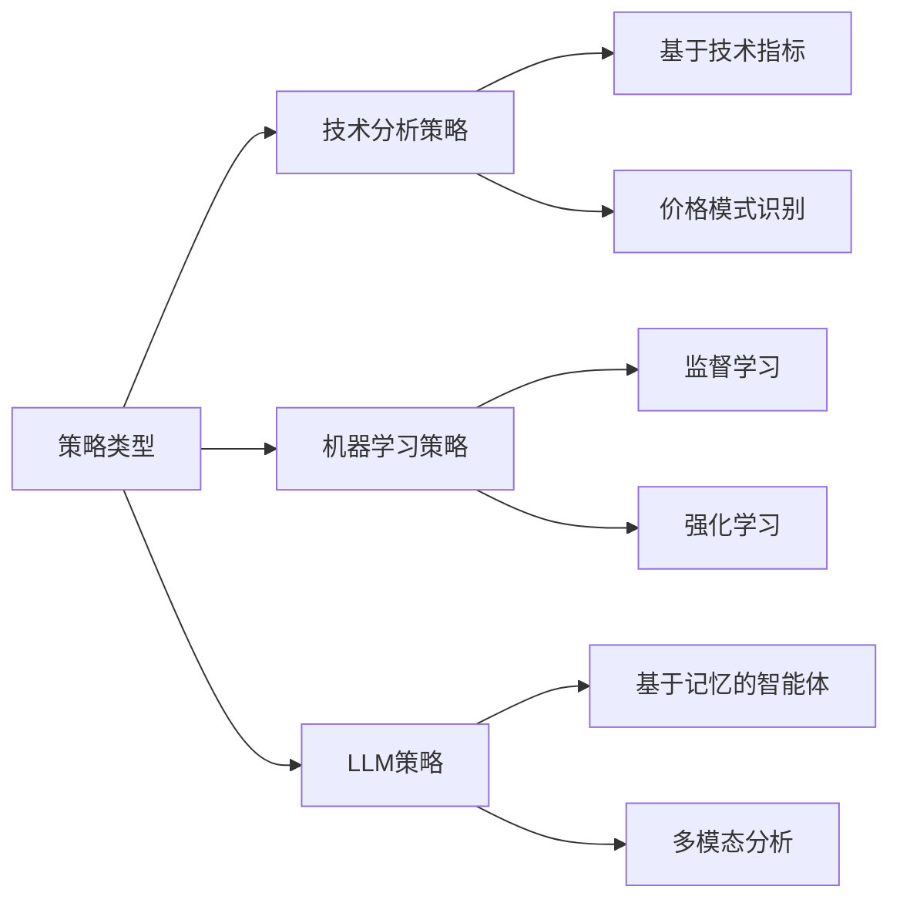

# 策略开发指南

本指南详细介绍如何在FINSABER框架中开发自定义交易策略。

## 策略类型概览

FINSABER支持三种主要策略类型：



## 技术分析策略开发

### 基础策略结构

所有技术分析策略都继承自`BaseStrategy`基类：

```python
from backtest.strategy.timing.base_strategy import BaseStrategy
import pandas as pd

class MyTechnicalStrategy(BaseStrategy):
    def __init__(self, short_window=20, long_window=50, **kwargs):
        super().__init__(**kwargs)
        self.short_window = short_window
        self.long_window = long_window
        self.position = 0  # 当前持仓: 0=空仓, 1=持有
        
    def next(self):
        """每个交易日执行的策略逻辑"""
        # 获取当前价格数据
        current_close = self.data.close[0]
        
        # 计算技术指标
        if len(self.data.close) < self.long_window:
            return  # 数据不足，跳过
            
        short_ma = self.data.close.get(size=self.short_window).mean()
        long_ma = self.data.close.get(size=self.long_window).mean()
        
        # 交易逻辑
        if short_ma > long_ma and self.position == 0:
            # 金叉买入信号
            self.buy()
            self.position = 1
            
        elif short_ma < long_ma and self.position == 1:
            # 死叉卖出信号
            self.sell()
            self.position = 0
```

### 高级技术指标策略

```python
import numpy as np
from backtest.strategy.timing.base_strategy import BaseStrategy

class RSIMeanReversionStrategy(BaseStrategy):
    def __init__(self, rsi_period=14, oversold=30, overbought=70, **kwargs):
        super().__init__(**kwargs)
        self.rsi_period = rsi_period
        self.oversold = oversold
        self.overbought = overbought
        self.position = 0
        
    def calculate_rsi(self, prices, period):
        """计算RSI指标"""
        deltas = np.diff(prices)
        gains = np.where(deltas > 0, deltas, 0)
        losses = np.where(deltas < 0, -deltas, 0)
        
        avg_gain = np.mean(gains[-period:])
        avg_loss = np.mean(losses[-period:])
        
        if avg_loss == 0:
            return 100
        
        rs = avg_gain / avg_loss
        rsi = 100 - (100 / (1 + rs))
        return rsi
        
    def next(self):
        if len(self.data.close) < self.rsi_period + 1:
            return
            
        prices = np.array([self.data.close[-i] for i in range(self.rsi_period + 1, 0, -1)])
        current_rsi = self.calculate_rsi(prices, self.rsi_period)
        
        # RSI均值回复策略
        if current_rsi < self.oversold and self.position == 0:
            self.buy()
            self.position = 1
        elif current_rsi > self.overbought and self.position == 1:
            self.sell() 
            self.position = 0
```

## 机器学习策略开发

### 监督学习策略框架

```python
from backtest.strategy.timing.base_strategy import BaseStrategy
from sklearn.ensemble import RandomForestClassifier
import pandas as pd
import numpy as np

class MLPredictorStrategy(BaseStrategy):
    def __init__(self, training_years=2, feature_lookback=30, **kwargs):
        super().__init__(**kwargs)
        self.training_years = training_years
        self.feature_lookback = feature_lookback
        self.model = None
        self.position = 0
        self.trained = False
        
    def prepare_features(self, data, lookback):
        """准备特征数据"""
        features = []
        
        # 技术指标特征
        for i in range(1, lookback + 1):
            if len(data) >= i:
                features.extend([
                    data.close[-i] / data.close[-min(i+1, len(data))] - 1,  # 收益率
                    data.volume[-i] / data.volume[-min(i+10, len(data)):].mean() - 1,  # 成交量相对强度
                    (data.high[-i] - data.low[-i]) / data.close[-i],  # 波动率
                ])
        
        return np.array(features).flatten()
        
    def prepare_target(self, data, forward_days=5):
        """准备目标变量"""
        if len(data) < forward_days + 1:
            return 0
        
        current_price = data.close[0]
        future_price = data.close[-forward_days]  
        return 1 if future_price > current_price else 0
        
    def train(self):
        """训练模型"""
        if self.trained:
            return
            
        # 获取训练数据
        training_data = self.get_training_data()
        
        X_train, y_train = [], []
        
        for i in range(self.feature_lookback, len(training_data) - 5):
            # 准备特征
            window_data = training_data[i-self.feature_lookback:i]
            features = self.prepare_features(window_data, self.feature_lookback)
            
            # 准备目标
            future_data = training_data[i:i+6]
            target = self.prepare_target(future_data)
            
            if len(features) > 0:
                X_train.append(features)
                y_train.append(target)
        
        if len(X_train) < 50:  # 数据不足
            raise InsufficientTrainingDataException("训练数据不足")
            
        # 训练模型
        self.model = RandomForestClassifier(n_estimators=100, random_state=42)
        self.model.fit(X_train, y_train)
        self.trained = True
        
    def next(self):
        if not self.trained or len(self.data) < self.feature_lookback:
            return
            
        # 准备当前特征
        current_features = self.prepare_features(self.data, self.feature_lookback)
        
        if len(current_features) == 0:
            return
            
        # 预测
        prediction = self.model.predict_proba([current_features])[0]
        buy_probability = prediction[1]
        
        # 交易决策
        if buy_probability > 0.6 and self.position == 0:
            self.buy()
            self.position = 1
        elif buy_probability < 0.4 and self.position == 1:
            self.sell()
            self.position = 0
```

### 强化学习策略示例

```python
from backtest.strategy.timing.base_strategy import BaseStrategy
import numpy as np
import gym
from stable_baselines3 import PPO

class RLTradingStrategy(BaseStrategy):
    def __init__(self, training_years=2, **kwargs):
        super().__init__(**kwargs)
        self.training_years = training_years
        self.model = None
        self.env = None
        self.position = 0
        self.trained = False
        
    def create_environment(self, data):
        """创建交易环境"""
        class TradingEnv(gym.Env):
            def __init__(self, price_data):
                super().__init__()
                self.price_data = price_data
                self.current_step = 0
                self.position = 0
                
                # 定义动作空间: 0=持有, 1=买入, 2=卖出
                self.action_space = gym.spaces.Discrete(3)
                
                # 定义观察空间: 价格特征
                self.observation_space = gym.spaces.Box(
                    low=-np.inf, high=np.inf, shape=(10,), dtype=np.float32
                )
                
            def step(self, action):
                # 实现环境步进逻辑
                reward = self.calculate_reward(action)
                self.current_step += 1
                
                done = self.current_step >= len(self.price_data) - 1
                obs = self.get_observation()
                
                return obs, reward, done, {}
                
            def reset(self):
                self.current_step = 0
                self.position = 0
                return self.get_observation()
                
            def get_observation(self):
                # 返回当前状态观察
                if self.current_step < 10:
                    return np.zeros(10)
                    
                returns = np.diff(self.price_data[self.current_step-10:self.current_step])
                return returns.astype(np.float32)
                
            def calculate_reward(self, action):
                # 计算奖励函数
                if self.current_step == 0:
                    return 0
                    
                price_return = (self.price_data[self.current_step] / 
                               self.price_data[self.current_step-1] - 1)
                
                if action == 1 and self.position == 0:  # 买入
                    self.position = 1
                    return price_return
                elif action == 2 and self.position == 1:  # 卖出
                    self.position = 0
                    return -price_return
                else:  # 持有
                    return price_return * self.position
        
        return TradingEnv(data)
        
    def train(self):
        """训练强化学习模型"""
        if self.trained:
            return
            
        # 获取训练数据
        training_data = self.get_training_data()
        prices = [candle.close for candle in training_data]
        
        if len(prices) < 100:
            raise InsufficientTrainingDataException("训练数据不足")
            
        # 创建环境并训练
        self.env = self.create_environment(prices)
        self.model = PPO("MlpPolicy", self.env, verbose=1)
        self.model.learn(total_timesteps=10000)
        
        self.trained = True
        
    def next(self):
        if not self.trained:
            return
            
        # 获取当前观察
        obs = self.get_current_observation()
        
        # 模型预测动作
        action, _ = self.model.predict(obs)
        
        # 执行动作
        if action == 1 and self.position == 0:  # 买入
            self.buy()
            self.position = 1
        elif action == 2 and self.position == 1:  # 卖出
            self.sell()
            self.position = 0
```

## LLM策略开发

### 基础LLM策略结构

```python
from backtest.strategy.timing_llm.base_strategy_iso import BaseStrategyISO
from llm_traders.finmem.puppy.agent import FinMemAgent

class CustomLLMStrategy(BaseStrategyISO):
    def __init__(self, config, **kwargs):
        super().__init__(**kwargs)
        self.config = config
        self.agent = None
        self.position = 0
        self.trade_history = []
        
    def initialize_agent(self):
        """初始化LLM智能体"""
        self.agent = FinMemAgent(
            model_name=self.config.get("model", "gpt-4"),
            temperature=self.config.get("temperature", 0.1),
            max_tokens=self.config.get("max_tokens", 1000)
        )
        
        # 配置记忆系统
        if self.config.get("enable_memory", True):
            self.agent.setup_memory(
                memory_type="faiss",
                window_size=self.config.get("memory_window", 30)
            )
            
    def prepare_market_context(self, current_date):
        """准备市场上下文信息"""
        # 获取价格数据
        price_data = self.get_price_data(current_date, lookback=30)
        
        # 获取新闻数据
        news_data = self.get_news_data(current_date, lookback=7)
        
        # 获取技术指标
        technical_indicators = self.calculate_technical_indicators(price_data)
        
        context = {
            "symbol": self.symbol,
            "date": current_date,
            "price_data": price_data,
            "news_data": news_data,
            "technical_indicators": technical_indicators,
            "current_position": self.position,
            "trade_history": self.trade_history[-10:]  # 最近10笔交易
        }
        
        return context
        
    def next(self):
        if self.agent is None:
            self.initialize_agent()
            
        current_date = self.data.datetime[0]
        
        # 准备市场上下文
        market_context = self.prepare_market_context(current_date)
        
        # LLM决策
        decision = self.agent.make_trading_decision(market_context)
        
        # 执行交易
        self.execute_decision(decision, current_date)
        
    def execute_decision(self, decision, date):
        """执行交易决策"""
        action = decision.get("action", "hold")
        confidence = decision.get("confidence", 0.5)
        reasoning = decision.get("reasoning", "")
        
        # 记录决策
        trade_record = {
            "date": date,
            "action": action,
            "confidence": confidence,
            "reasoning": reasoning,
            "price": self.data.close[0]
        }
        
        # 执行交易
        if action == "buy" and self.position == 0 and confidence > 0.7:
            self.buy()
            self.position = 1
            trade_record["executed"] = True
            
        elif action == "sell" and self.position == 1 and confidence > 0.7:
            self.sell()
            self.position = 0
            trade_record["executed"] = True
            
        else:
            trade_record["executed"] = False
            
        self.trade_history.append(trade_record)
```

### 多模态LLM策略

```python
class MultimodalLLMStrategy(BaseStrategyISO):
    def __init__(self, config, **kwargs):
        super().__init__(**kwargs)
        self.config = config
        self.vision_model = None
        self.text_model = None
        
    def initialize_models(self):
        """初始化多模态模型"""
        # 文本分析模型
        self.text_model = OpenAI(
            model=self.config.get("text_model", "gpt-4"),
            temperature=self.config.get("temperature", 0.1)
        )
        
        # 视觉分析模型
        self.vision_model = OpenAI(
            model=self.config.get("vision_model", "gpt-4-vision"),
            temperature=self.config.get("temperature", 0.1)
        )
        
    def analyze_chart_pattern(self, price_data):
        """分析图表模式"""
        # 生成价格图表
        chart_image = self.generate_chart(price_data)
        
        # 视觉模型分析
        vision_prompt = """
        分析这个股票价格图表，识别以下技术模式：
        1. 趋势（上升、下降、横盘）
        2. 支撑阻力位
        3. 图表形态（头肩顶、双底等）
        4. 成交量模式
        
        请提供详细分析和交易建议。
        """
        
        vision_analysis = self.vision_model.analyze_image(
            chart_image, 
            vision_prompt
        )
        
        return vision_analysis
        
    def analyze_sentiment(self, news_data):
        """分析市场情绪"""
        text_prompt = f"""
        分析以下新闻对股票 {self.symbol} 的影响：
        
        新闻内容：
        {news_data}
        
        请从以下角度分析：
        1. 情绪倾向（积极/消极/中性）
        2. 影响程度（高/中/低）
        3. 时间影响（短期/长期）
        4. 投资建议
        """
        
        sentiment_analysis = self.text_model.completion(text_prompt)
        return sentiment_analysis
        
    def next(self):
        if self.text_model is None:
            self.initialize_models()
            
        # 获取数据
        price_data = self.get_recent_price_data()
        news_data = self.get_recent_news()
        
        # 多模态分析
        chart_analysis = self.analyze_chart_pattern(price_data)
        sentiment_analysis = self.analyze_sentiment(news_data)
        
        # 综合决策
        final_decision = self.make_integrated_decision(
            chart_analysis, 
            sentiment_analysis
        )
        
        # 执行交易
        self.execute_decision(final_decision)
```

## 策略回测优化

### 参数优化框架

```python
import optuna
from backtest.finsaber import FINSABER

class StrategyOptimizer:
    def __init__(self, strategy_class, data_config, optimization_config):
        self.strategy_class = strategy_class
        self.data_config = data_config
        self.optimization_config = optimization_config
        
    def objective(self, trial):
        """Optuna优化目标函数"""
        # 根据策略类型建议参数
        params = self.suggest_parameters(trial)
        
        # 运行回测
        finsaber = FINSABER(self.data_config)
        results = finsaber.run_iterative_tickers(
            self.strategy_class,
            strat_params=params
        )
        
        # 计算优化目标（如夏普比率）
        sharpe_ratios = []
        for ticker_results in results.values():
            if "sharpe_ratio" in ticker_results:
                sharpe_ratios.append(ticker_results["sharpe_ratio"])
                
        return np.mean(sharpe_ratios) if sharpe_ratios else -1
        
    def suggest_parameters(self, trial):
        """参数建议"""
        if self.strategy_class.__name__ == "SMACrossoverStrategy":
            return {
                "short_window": trial.suggest_int("short_window", 5, 50),
                "long_window": trial.suggest_int("long_window", 20, 200)
            }
        elif self.strategy_class.__name__ == "RSIStrategy":
            return {
                "rsi_period": trial.suggest_int("rsi_period", 10, 30),
                "oversold": trial.suggest_int("oversold", 20, 40),
                "overbought": trial.suggest_int("overbought", 60, 80)
            }
        # 添加更多策略的参数建议
        
    def optimize(self, n_trials=100):
        """执行优化"""
        study = optuna.create_study(direction="maximize")
        study.optimize(self.objective, n_trials=n_trials)
        
        return study.best_params, study.best_value
```

### 风险管理模块

```python
class RiskManager:
    def __init__(self, max_position_size=0.1, stop_loss=0.05, take_profit=0.15):
        self.max_position_size = max_position_size
        self.stop_loss = stop_loss
        self.take_profit = take_profit
        self.entry_price = None
        
    def should_enter(self, signal_strength, portfolio_value, stock_price):
        """判断是否应该入场"""
        position_value = stock_price * self.get_position_size(portfolio_value, stock_price)
        max_position_value = portfolio_value * self.max_position_size
        
        return (signal_strength > 0.7 and 
                position_value <= max_position_value)
                
    def should_exit(self, current_price, reason="signal"):
        """判断是否应该出场"""
        if self.entry_price is None:
            return False
            
        current_return = (current_price - self.entry_price) / self.entry_price
        
        # 止损
        if current_return <= -self.stop_loss:
            return True, "stop_loss"
            
        # 止盈
        if current_return >= self.take_profit:
            return True, "take_profit"
            
        # 信号出场
        if reason == "signal":
            return True, "signal"
            
        return False, None
        
    def get_position_size(self, portfolio_value, stock_price):
        """计算仓位大小"""
        max_shares = int((portfolio_value * self.max_position_size) / stock_price)
        return max_shares
```

## 策略测试与验证

### 单元测试示例

```python
import unittest
from unittest.mock import Mock, MagicMock

class TestMyStrategy(unittest.TestCase):
    def setUp(self):
        """测试准备"""
        self.strategy = MyTechnicalStrategy(short_window=10, long_window=20)
        self.strategy.data = Mock()
        self.strategy.buy = Mock()
        self.strategy.sell = Mock()
        
    def test_buy_signal(self):
        """测试买入信号"""
        # 模拟金叉情况
        self.strategy.data.close.get.side_effect = [110, 100]  # short_ma > long_ma
        self.strategy.position = 0
        
        self.strategy.next()
        
        self.strategy.buy.assert_called_once()
        
    def test_sell_signal(self):
        """测试卖出信号"""
        # 模拟死叉情况
        self.strategy.data.close.get.side_effect = [90, 100]  # short_ma < long_ma
        self.strategy.position = 1
        
        self.strategy.next()
        
        self.strategy.sell.assert_called_once()
        
if __name__ == "__main__":
    unittest.main()
```

### 策略验证工具

```python
class StrategyValidator:
    def __init__(self, strategy_class):
        self.strategy_class = strategy_class
        
    def validate_implementation(self):
        """验证策略实现"""
        errors = []
        
        # 检查必要方法
        required_methods = ["next"]
        for method in required_methods:
            if not hasattr(self.strategy_class, method):
                errors.append(f"缺少必要方法: {method}")
                
        # 检查继承关系
        from backtest.strategy.timing.base_strategy import BaseStrategy
        if not issubclass(self.strategy_class, BaseStrategy):
            errors.append("策略必须继承BaseStrategy")
            
        return errors
        
    def performance_test(self, test_data):
        """性能测试"""
        import time
        
        start_time = time.time()
        
        # 运行策略
        strategy = self.strategy_class()
        for _ in range(1000):  # 模拟1000个交易日
            strategy.next()
            
        end_time = time.time()
        execution_time = end_time - start_time
        
        return {
            "execution_time": execution_time,
            "avg_time_per_day": execution_time / 1000
        }
```

## 最佳实践

### 1. 代码组织

```python
# 策略文件结构建议
my_strategy/
├── __init__.py
├── strategy.py          # 主策略类
├── indicators.py        # 技术指标
├── risk_manager.py      # 风险管理
├── config.py           # 配置参数
└── tests/
    ├── test_strategy.py
    └── test_indicators.py
```

### 2. 日志记录

```python
import logging

class LoggingStrategy(BaseStrategy):
    def __init__(self, **kwargs):
        super().__init__(**kwargs)
        self.logger = logging.getLogger(self.__class__.__name__)
        
    def next(self):
        self.logger.info(f"处理日期: {self.data.datetime[0]}")
        self.logger.debug(f"当前价格: {self.data.close[0]}")
        
        # 策略逻辑...
        
        if signal:
            self.logger.info(f"生成交易信号: {signal}")
```

### 3. 配置管理

```python
# config.py
STRATEGY_CONFIG = {
    "MyTechnicalStrategy": {
        "short_window": 20,
        "long_window": 50,
        "risk_management": {
            "max_position_size": 0.1,
            "stop_loss": 0.05
        }
    }
}
```

### 4. 版本控制

使用Git管理策略版本，建议的提交信息格式：
```
feat: 添加RSI均值回复策略
fix: 修复SMA交叉策略信号延迟问题  
perf: 优化特征计算性能
test: 添加策略单元测试
docs: 更新策略使用文档
```

通过遵循这些开发指南，您可以创建高质量、可维护的交易策略，并充分利用FINSABER框架的强大功能。